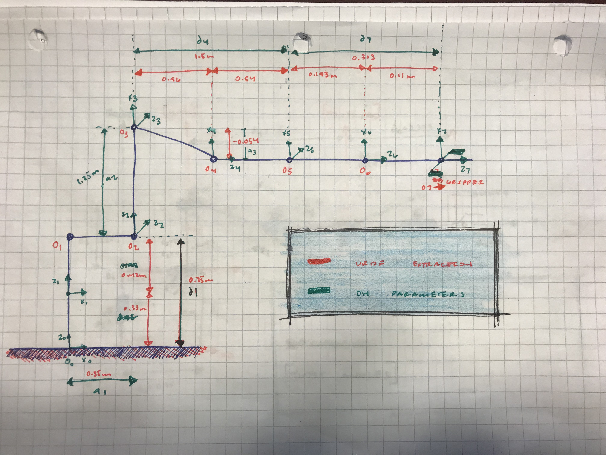
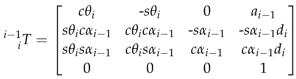

## Project: Kinematics Pick & Place
### Writeup Template: You can use this file as a template for your writeup if you want to submit it as a markdown file, but feel free to use some other method and submit a pdf if you prefer.

---

**Steps to complete the project:**  

1. Set up your ROS Workspace.
2. Download or clone the [project repository](https://github.com/udacity/RoboND-Kinematics-Project) into the ***src*** directory of your ROS Workspace.  
3. Experiment with the forward_kinematics environment and get familiar with the robot.
4. Launch in [demo mode](https://classroom.udacity.com/nanodegrees/nd209/parts/7b2fd2d7-e181-401e-977a-6158c77bf816/modules/8855de3f-2897-46c3-a805-628b5ecf045b/lessons/91d017b1-4493-4522-ad52-04a74a01094c/concepts/ae64bb91-e8c4-44c9-adbe-798e8f688193).
5. Perform Kinematic Analysis for the robot following the [project rubric](https://review.udacity.com/#!/rubrics/972/view).
6. Fill in the `IK_server.py` with your Inverse Kinematics code. 

[//]: # (Image References)

[image1]: ./misc_images/misc1.png
[image2]: ./misc_images/misc3.png
[image3]: ./misc_images/misc2.png

## [Rubric](https://review.udacity.com/#!/rubrics/972/view) Points
### Here I will consider the rubric points individually and describe how I addressed each point in my implementation.  

---
### Writeup / README

#### 1. Provide a Writeup / README that includes all the rubric points and how you addressed each one.  You can submit your writeup as markdown or pdf.  

You're reading it!

#### Installation steps:

Clone this repository to your home directory:

    $ ggit clone https://github.com/udacity/RoboND-Kinematics-Project.git

Install missing ROS dependencies using the rosdep install command:

    $ cd ~/catkin_ws/
    $ rosdep install --from-paths src --ignore-src --rosdistro=kinetic -y

Run catkin_make from within your workspace to build the project:

    $ cd ~/catkin_ws/
    $ catkin_make

Run the following shell commands to source the setup files:

    $ echo "source ~/catkin_ws/devel/setup.bash" >> ~/.bashrc

For demo mode make sure the demo flag is set to true in inverse_kinematics.launch file under

    ~/catkin_ws/src/kuka_arm/launch/
    
#### Demo Mode:
  
To run forward kinematics test us:

    $ roslaunch kuka_arm forward_kinematics.launch
    
To run simulator use:

    $ rosrun kuka_arm safe_spawner.sh

To run IK Server use:

    $ rosrun kuka_arm IK_server.py 

### Kinematic Analysis 
#### 1. Run the forward_kinematics demo and evaluate the kr210.urdf.xacro file to perform kinematic analysis of Kuka KR210 robot and derive its DH parameters.

URDF joint position and orientation extraction from the kr210.urdf.xacro file: 

      <!-- joints -->
      <joint name="fixed_base_joint" type="fixed">
        <parent link="base_footprint"/>
        <child link="base_link"/>
        <origin xyz="0 0 0" rpy="0 0 0"/>
      </joint>
      <joint name="joint_1" type="revolute">
        <origin xyz="0 0 0.33" rpy="0 0 0"/>
        <parent link="base_link"/>
        <child link="link_1"/>
        <axis xyz="0 0 1"/>
        <limit lower="${-185*deg}" upper="${185*deg}" effort="300" velocity="${123*deg}"/>
      </joint>
      <joint name="joint_2" type="revolute">
        <origin xyz="0.35 0 0.42" rpy="0 0 0"/>
        <parent link="link_1"/>
        <child link="link_2"/>
        <axis xyz="0 1 0"/>
        <limit lower="${-45*deg}" upper="${85*deg}" effort="300" velocity="${115*deg}"/>
      </joint>
      <joint name="joint_3" type="revolute">
        <origin xyz="0 0 1.25" rpy="0 0 0"/>
        <parent link="link_2"/>
        <child link="link_3"/>
        <axis xyz="0 1 0"/>
        <limit lower="${-210*deg}" upper="${(155-90)*deg}" effort="300" velocity="${112*deg}"/>
      </joint>
      <joint name="joint_4" type="revolute">
        <origin xyz="0.96 0 -0.054" rpy="0 0 0"/>
        <parent link="link_3"/>
        <child link="link_4"/>
        <axis xyz="1 0 0"/>
        <limit lower="${-350*deg}" upper="${350*deg}" effort="300" velocity="${179*deg}"/>
      </joint>
      <joint name="joint_5" type="revolute">
        <origin xyz="0.54 0 0" rpy="0 0 0"/>
        <parent link="link_4"/>
        <child link="link_5"/>
        <axis xyz="0 1 0"/>
        <limit lower="${-125*deg}" upper="${125*deg}" effort="300" velocity="${172*deg}"/>
      </joint>
      <joint name="joint_6" type="revolute">
        <origin xyz="0.193 0 0" rpy="0 0 0"/>
        <parent link="link_5"/>
        <child link="link_6"/>
        <axis xyz="1 0 0"/>
        <limit lower="${-350*deg}" upper="${350*deg}" effort="300" velocity="${219*deg}"/>
      </joint>

URDF joint positions and orientations extraction table:

0   | joint | parent | child | x | y | z | r | p | y
--- | --- | --- | --- | --- |--- | --- | --- | --- | --- |
0 | fixed_base | base_footprint | base_link | 0 | 0 | 0 | 0| 0 | 0
1 | joint_1 | base_link | link_1 | 0 | 0 | 0.33 | 0 | 0 | 0
2 | joint_2 | link_1 | link_2 | 0.35 | 0 | 0.42 | 0 | 0 | 0
3 | joint_3 | link_2 | link_3  | 0 | 0 | 1.25 | 0 | 0 | 0
4 | joint_4 | link_3 | link_4  | 0.96 | 0 | -0.054  | 0 | 0 | 0
5 | joint_5 | link_4 | link_5  | 0.54 | 0 | 0 | 0 | 0 | 0
6 | joint_6 | link_5 | link_6  | 0.193 | 0 | 0 | 0 | 0 | 0
7 | gripper | link_6 | grip_link  | 0.193 | 0 | 0 | 0 | 0 | 0
. | total | |  | 2.153 | 0 | 1.946 | 0 | 0 | 0

Translate x and z coordinates into link length and link offset for dh parameter table:

show all the DH Parameters in respect to a 6DOF drawing: 

Elements of the DH Parameter table for producing individual transforms and homogeneous transform:

    Origin O(i) = intersection between Xi and Zi axis

    a = Link Length: a(i-1) = Zi-1 - Zi along the X(i-1) axis

    d = Link Offset: d(i) = X(i-1) - X(i) along Z(i) axis

    alpha = Link Twist: alpha(i-1) = angle from Z(i-1) to Z(i) measured about Xi-1 using right hand rule

    q = theta = Joint Angle: theta(i) = angle from X(i-1) to X(i) measured about Zi using right hand rule. all joint angles     will be zero at initial Robot state in KR210 except joint 2 which has a -90 degree constant offset between X(1) and         X(2).

Begin the coding by importing all the proper libraries:

    import numpy as np
    from numpy import array
    from sympy import symbols, cos, sin, pi, simplify, sqrt, atan2, pprint
    from sympy.matrices import Matrix

Establish variables for the dh table and homogeneous transform:

    q1, q2, q3, q4,q5, q6, q7 = symbols('q1:8')
    d1, d2, d3, d4,d5,d6,d7 = symbols('d1:8')
    a0, a1, a2, a3, a4, a5, a6 = symbols('a0:7')
    alpha0, alpha1, alpha2, alpha3, alpha4, alpha5, alpha6 = symbols('alpha0:7')

Kuka KR210 robot DH parameters:

Links | alpha(i-1) | a(i-1) | d(i-1) | theta(i)
--- | --- | --- | --- | ---
0->1 | 0 | 0 | 0.75 | q1
1->2 | - 90 | 0.35 | 0 | -90 + q2
2->3 | 0 | 0 | 1.25 | q3
3->4 |  -90 | -0.05 | 1.5 | q4
4->5 | 90 | 0 | 0 | q5
5->6 | -90 | 0 | 0 | q6
6->EE | 0 | 0 | 0.303 | q7

Set the dh parameter information as a dictionary:

    dh_Params = { alpha0:      0, a0:     0, d1: 0.75, q1:         q1,    
                  alpha1: -pi/2., a1:  0.35, d2:    0, q2:-pi/2. + q2,
                  alpha2:      0, a2:  1.25, d3:    0, q3:         q3,
                  alpha3: -pi/2., a3:-0.054, d4:  1.5, q4:         q4,
                  alpha4:  pi/2., a4:     0, d5:    0, q5:         q5,
                  alpha5: -pi/2., a5:     0, d6:    0, q6:         q6,
                  alpha6:      0, a6:     0, d7:0.303, q7:         0 }

#### 2. Using the DH parameter table you derived earlier, create individual transformation matrices about each joint. In addition, also generate a generalized homogeneous transform between base_link and gripper_link using only end-effector(gripper) pose.

DH parameter table allows us to generate individual transforms between various links:

Transform from one frame to another using the following matrix:

Generate function to return the homogeneous transform between each link:

    def h_transform(alpha,a,d,q):

        h_t = Matrix([[           cos(q),           -sin(q),          0 ,            a],
                      [sin(q)*cos(alpha), cos(q)*cos(alpha), -sin(alpha),-sin(alpha)*d],
                      [sin(q)*sin(alpha), cos(q)*sin(alpha),  cos(alpha), cos(alpha)*d],
                      [                0,                 0,           0,            1]])

        return h_t

Perform the homogeneous transform between the links:

    T0_T1 = h_transform(alpha0,a0,d1,q1).subs(dh_Params)
    T1_T2 = h_transform(alpha1,a1,d2,q2).subs(dh_Params) 
    T2_T3 = h_transform(alpha2,a2,d3,q3).subs(dh_Params)
    T3_T4 = h_transform(alpha3,a3,d4,q4).subs(dh_Params)
    T4_T5 = h_transform(alpha4,a4,d5,q5).subs(dh_Params)
    T5_T6 = h_transform(alpha5,a5,d6,q6).subs(dh_Params)
    T6_T7 = h_transform(alpha6,a6,d7,q7).subs(dh_Params)

Get the composition of all transforms from base to gripper multiply the individual matrices: 

    T0_T2 = ( T0_T1 * T1_T2 )
    T0_T3 = ( T0_T2 * T2_T3 )
    T0_T4 = ( T0_T3 * T3_T4 )
    T0_T5 = ( T0_T4 * T4_T5 )
    T0_T6 = ( T0_T5 * T5_T6 )
    T0_T7 = ( T0_T6 * T6_T7 )

Correction Needed to Account for Orientation Difference between definition of Gripper Link_G in URDF versus DH Convention:

    R_y = Matrix([[ cos(-pi/2.),        0, sin(-pi/2.), 0 ],
                  [           0,       1.,           0, 0 ],
                  [-sin(-pi/2.),        0, cos(-pi/2.), 0 ],
                  [           0,        0,           0, 1 ]])

    R_z = Matrix([[     cos(pi), -sin(pi),           0, 0 ],
                  [     sin(pi),  cos(pi),           0, 0 ],
                  [           0,        0,          1., 0 ],
                  [           0,        0,           0, 1.]])

    R_corr = (R_z * R_y)

Total Homogeneous Transform Between (Base) Link_0 and (End Effector) Link_7 with orientation correction applied:

    T0_T7_corr = (T0_T7 * R_corr)
    
#### Test the results: 

launch the fk simulator: 

    $ roslaunch kuka_arm forward_kinematics.launch

test_01 all thetas = 0: 

    T0_7 = T0_T7_corr.evalf(subs={q1: 0, q2: 0, q3: 0, q4: 0, q5: 0, q6: 0})
    
 image from python testing: 
 
 
    
 image from rviz joint information : 
 
 
 
 test_02 theta 1 = 0.77 and the rest of thetas = 0 : 
 
    T0_7 = T0_T7_corr.evalf(subs={q1: 0.77, q2: 0, q3: 0, q4: 0, q5: 0, q6: 0})
    
 image from python testing: 
 
 
 
 image from rviz joint information : 

 

#### 3. Decouple Inverse Kinematics problem into Inverse Position Kinematics and inverse Orientation Kinematics; doing so derive the equations to calculate all individual joint angles.

#### Inverse Position

First step is to get the end-effector position(Px, Py, Pz) and orientation (Roll, Pitch, Yaw) from the test cases data class 
 
 Requested end-effector (EE) position:
 
    px = req.poses[x].position.x
    py = req.poses[x].position.y
    pz = req.poses[x].position.z
    
store EE position in a matrix:

    EE = Matrix([[px],
                 [py],
                 [pz]])

Requested end-effector (EE) orientation (roll pitch yaw that will be used to identify the rotation matrix for the ee):
 
    (roll,pitch,yaw) = tf.transformations.euler_from_quaternion(
        [req.poses[x].orientation.x,
         req.poses[x].orientation.y,
         req.poses[x].orientation.z,
         req.poses[x].orientation.w])
         
We will need rotation matrix for the end-effector:

  #### R_rpy = Rot(Z, yaw) * Rot(Y, pitch) * Rot(X, roll)

Find EE rotation matrix RPY (Roll, Pitch, Yaw):

    r,p,y = symbols('r p y')

    # Roll
    ROT_x = Matrix([[       1,       0,       0],
                    [       0,  cos(r), -sin(r)],
                    [       0,  sin(r),  cos(r)]])
    # Pitch
    ROT_y = Matrix([[  cos(p),       0,  sin(p)],
                    [       0,       1,       0],
                    [ -sin(p),       0,  cos(p)]])
    # Yaw
    ROT_z = Matrix([[  cos(y), -sin(y),       0],
                    [  sin(y),  cos(y),       0],
                    [       0,       0,       1]])

    ROT_EE = ROT_z * ROT_y * ROT_x
    

orientation difference correction matrix (Rot_corr) as earlier discussed in FK section.

  #### R_EE = R_rpy * R_corr    
    
Correction Needed to Account for Orientation Difference Between
Definition of Gripper Link_G in URDF versus DH Convention:

    ROT_corr = ROT_z.subs(y, radians(180)) * ROT_y.subs(p, radians(-90))
    ROT_EE = ROT_EE * ROT_corr

substiute the r p y to find the ee rotation matrix:

    ROT_EE = ROT_EE.subs({'r': roll, 'p': pitch, 'y': yaw})

Symbolically define our homogeneous transform as following:

  

where l, m and n are orthonormal vectors representing the end-effector orientation along X, Y, Z axes of the local coordinate frame.

Since n is the vector along the z-axis of the gripper_link, we can say the following

Px, Py, Pz = end-effector positions

Wx, Wy, Wz = wrist positions

d6 = from DH table

_l_ = end-effector length

nx, ny, and nz values from this Rrpy matrix to obtain the wrist center position.
 
 

Calculate Wrest Center:

    WC = EE - (0.303) * ROT_EE[:,2]
    

Define out theta values through trignometry:

To find 𝜃1, project Wz onto the ground plane:

 

Calculate theta1:

    theta1 = atan2(WC[1],WC[0])
    
To find 𝜃2 and 𝜃3 , we will need to isolate the proper triangle associated with the angles:

A = d4 = 1.5

C = a2 = 1.25

3rd side = B needs to be calculated as follows:

    side_A = 1.501
    side_C = 1.25
    side_B = sqrt(pow((sqrt(WC[0]*WC[0] + WC[1]*WC[1]) - 0.35), 2) + pow((WC[2] - 0.75), 2))

All three sides of the triangle are known. To calculate all of the three inner angles of the triangle from the known three sides use Cosine Laws SSS:

 

find the interior angles of a,b,c:

    a = acos((side_B*side_B + side_C*side_C - side_A*side_A) / (2*side_B*side_C))
    b = acos((side_A*side_A + side_C*side_C - side_B*side_B) / (2*side_A*side_C))
    c = acos((side_A*side_A + side_B*side_B - side_C*side_C) / (2*side_A*side_B))

find theta2 and theta3:

    theta2 = pi/2 - a - atan2(WC[2]-0.75, sqrt(WC[0]*WC[0]+WC[1]*WC[1])-0.35)
    theta3 = pi/2 - (b+0.036) # 0.036 accounts for sag in link4 of -0.054m

#### Inverse Orientation:
 
goal: find the final three joint variables 𝜃4,𝜃5 and 𝜃6.

Using the individual DH transforms we can obtain the resultant transform and hence resultant rotation by:

#### R0_6 = R0_1*R1_2*R2_3*R3_4*R4_5*R5_6

Since the overall RPY (Roll Pitch Yaw) rotation between base_link and gripper_link must be equal to the product of individual rotations between respective links, following holds true:

##### R0_6 = Rrpy

Rrpy = Homogeneous RPY rotation between base_link and gripper_link

We can substitute the values we calculated for joints 1 to 3 in their respective individual rotation matrices and pre-multiply both sides of the above equation by inv(R0_3) which leads to:

#### 3_6 = inv(R0_3) * Rrpy

Extract rotation matrix R0_3 from transformation matrix T0_3 the substitute angles q1-3:

    R0_3 = T0_T1[0:3,0:3] * T1_T2[0:3,0:3] * T2_T3[0:3,0:3]
    R0_3 = R0_3.evalf(subs={q1: theta1, q2: theta2, q3:theta3})

Get rotation matrix R3_6 from (transpose of R0_3 * R_EE):

    R3_6 = R0_3.inv("LU") * ROT_EE
    
Euler angles from rotation matrix:

    theta5 = atan2(sqrt(R3_6[0,2]*R3_6[0,2] + R3_6[2,2]*R3_6[2,2]),R3_6[1,2])
    
select best solution based on theta5:

    if (theta5 > pi) :
        theta4 = atan2(-R3_6[2,2], R3_6[0,2]) ## REVIEW THIS LINE SOLVING FOR THETA
        theta6 = atan2(R3_6[1,1],-R3_6[1,0])
    else:
        theta4 = atan2(R3_6[2,2], -R3_6[0,2])
        theta6 = atan2(-R3_6[1,1],R3_6[1,0]) 
 
 
 Testing the Inverse Kinematic Equation through the IK_debug.py: 
 
 Test 1 output:
 
    Total run time to calculate joint angles from pose is 1.1260 seconds

    Wrist error for x position is: 0.00000046
    Wrist error for y position is: 0.00000032
    Wrist error for z position is: 0.00000545
    Overall wrist offset is: 0.00000548 units

    Theta 1 error is: 0.00093770
    Theta 2 error is: 0.00181024
    Theta 3 error is: 0.00205031
    Theta 4 error is: 0.00172067
    Theta 5 error is: 0.00197873
    Theta 6 error is: 0.00251871

    **These theta errors may not be a correct representation of your code, due to the fact            
    that the arm can have muliple positions. It is best to add your forward kinmeatics to            
    confirm whether your code is working or not**

    End effector error for x position is: 0.00002010
    End effector error for y position is: 0.00001531
    End effector error for z position is: 0.00002660
    Overall end effector offset is: 0.00003668 units 
 
 
 Test 2 output: 
 
    Total run time to calculate joint angles from pose is 1.4115 seconds

    Wrist error for x position is: 0.00000046
    Wrist error for y position is: 0.00000032
    Wrist error for z position is: 0.00000545
    Overall wrist offset is: 0.00000548 units

    Theta 1 error is: 0.00093770
    Theta 2 error is: 0.00181024
    Theta 3 error is: 0.00205031
    Theta 4 error is: 0.00172067
    Theta 5 error is: 0.00197873
    Theta 6 error is: 0.00251871

    **These theta errors may not be a correct representation of your code, due to the fact            
    that the arm can have muliple positions. It is best to add your forward kinmeatics to            
    confirm whether your code is working or not**

    End effector error for x position is: 0.00002010
    End effector error for y position is: 0.00001531
    End effector error for z position is: 0.00002660
    Overall end effector offset is: 0.00003668 units
    
Test 3 output: 

    Total run time to calculate joint angles from pose is 1.1756 seconds

    Wrist error for x position is: 0.00000503
    Wrist error for y position is: 0.00000512
    Wrist error for z position is: 0.00000585
    Overall wrist offset is: 0.00000926 units

    Theta 1 error is: 0.00136747
    Theta 2 error is: 0.00325738
    Theta 3 error is: 0.00339563
    Theta 4 error is: 6.53212647
    Theta 5 error is: 0.39551490
    Theta 6 error is: 6.86340402

    **These theta errors may not be a correct representation of your code, due to the fact            
    that the arm can have muliple positions. It is best to add your forward kinmeatics to            
    confirm whether your code is working or not**

    End effector error for x position is: 0.04253562
    End effector error for y position is: 0.03889778
    End effector error for z position is: 0.12694560
    Overall end effector offset is: 0.13941844 units 

    
#### 1. Fill in the `IK_server.py` file with properly commented python code for calculating Inverse Kinematics based on previously performed Kinematic Analysis. Your code must guide the robot to successfully complete 8/10 pick and place cycles. Briefly discuss the code you implemented and your results. 

### Ik_server.py Project Implementation:

Steps for running the final ik based on previously performed Kinnematic Analysis:

run roscore:
    
    roscore
    
run the safe spawner script in a new terminal:

    ./safe_spawner.sh

launch the the proper ik_server.py

    rosrun kuka_arm IK_server.py

For the IK_server.py I moved the forward kinematics and the ee orientation to above the for loop which solves for the inverse knmetics. It certain areas I hard coded the proper numbers in to speed up run and simulation time. THe lag is not bad but could be optimized even further.

#### General: 

- All in all the testing an implemetation of the final ROS IK_server.py went smoothly.
- I was able to use all test files for the forward and inverse kinematics as well as run the python script IK_server.py for deploying my code for solving the inverse kinematics problem.
- I ran into a problem when running ROS in the fact that it could not locate the proper files when running demos and executing them so I had to run the following commands in the terminal for sourcing purposes before ROS Was able to access the proper files:

        robond@udacity:~$ cd ~/catkin_ws/

        robond@udacity:~/catkin_ws$ echo $ROS_PACKAGE_PATH

        /opt/ros/kinetic/share

        robond@udacity:~/catkin_ws$ source devel/setup.bash

        robond@udacity:~/catkin_ws$ echo $ROS_PACKAGE_PATH

        /home/robond/catkin_ws/src:/opt/ros/kinetic/share
        
 - The inverse kinematics seemed to be working well and the robot was able to pick and place the proper objects. THe motion of the robot was working in manner that seemed ready for real world testing.
 
        

